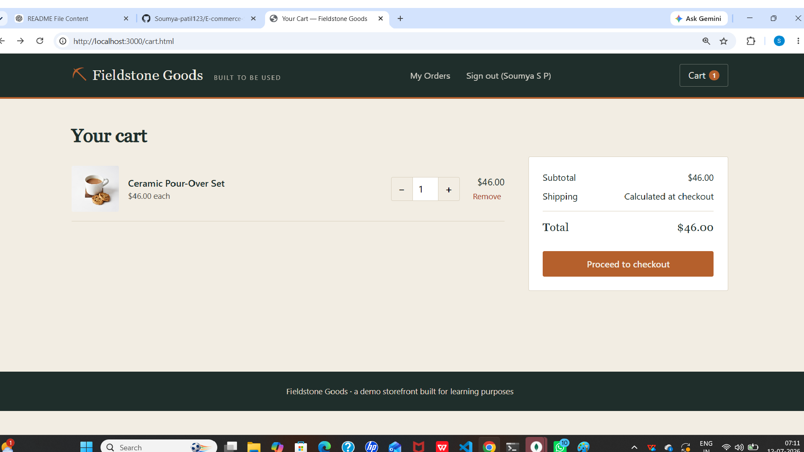

# Fieldstone Goods — Simple E-commerce Store

A basic e-commerce site built with **Express.js** (Node.js) on the backend and
plain **HTML / CSS / JavaScript** on the frontend, backed by a **SQLite**
database (via `better-sqlite3`).

## Features

- Product listing with category filter and search
- Product detail page with quantity selector
- Shopping cart (server-side, tied to your browser session)
- User registration and login (passwords hashed with bcrypt, session cookies)
- Checkout / order processing (creates an order + line items, decrements stock)
- Order history page

## Project structure

```
ecommerce-app/
├── server.js              # Express app entry point
├── package.json
├── db/
│   ├── database.js        # SQLite connection + schema
│   ├── seed.js             # Sample product data
│   └── store.db           # created automatically on first run
├── middleware/
│   └── auth.js             # requireAuth guard for protected routes
├── routes/
│   ├── auth.js              # register / login / logout / me
│   ├── products.js          # product listing + detail
│   ├── cart.js               # session cart CRUD
│   └── orders.js             # checkout + order history
└── public/                 # static frontend (served directly by Express)
    ├── index.html            # product listing / homepage
    ├── product.html           # single product detail
    ├── cart.html               # shopping cart
    ├── checkout.html           # shipping form + place order
    ├── orders.html              # order history
    ├── login.html
    ├── register.html
    ├── css/style.css
    └── js/*.js
```

## Setup

You'll need **Node.js 18+** installed locally.

```bash
cd ecommerce-app
npm install
npm run seed     # populates the database with sample products (run once)
npm start
```

Then open **http://localhost:3000** in your browser.

> `better-sqlite3` installs a native module, so `npm install` needs internet
> access and a working build toolchain (on most systems this "just works";
> on a fresh Linux box you may need `build-essential` and `python3`).

## How the pieces fit together

- **Database**: `db/database.js` opens `db/store.db` and creates four tables
  the first time it runs — `users`, `products`, `orders`, `order_items`.
  Nothing to configure; the file is created automatically.
- **Cart**: kept in the server-side session (`req.session.cart`), so it
  survives page reloads and works even before you log in. You only need to be
  signed in at checkout time.
- **Auth**: `express-session` issues a cookie; passwords are hashed with
  `bcryptjs` before being stored, never in plain text.
- **Orders**: checkout validates stock, creates an `orders` row and matching
  `order_items` rows in a single transaction, and decrements product stock.

## Extending it

A few natural next steps if you want to keep building:

- Add an admin view for managing products and viewing all orders
- Add product images upload instead of external URLs
- Hook up a real payment provider (Stripe, etc.) at checkout
- Move from cookie sessions to JWTs if you want a separate SPA/mobile client
- Add pagination to the product grid once the catalog grows

## Notes on this being a demo

This is meant as a learning-friendly reference implementation, not a
production-hardened store: there's no email verification, no rate limiting
on auth endpoints, and the session store is in-memory (resets if the server
restarts). For production you'd want a persistent session store (e.g.
`connect-sqlite3` or Redis), HTTPS, and environment-based secrets.

##add images
## 📸 Screenshots

### 🏠 Home Page


### 🛍️ Products Page


### 🛒 Cart Page


### 📦 Orders Page

